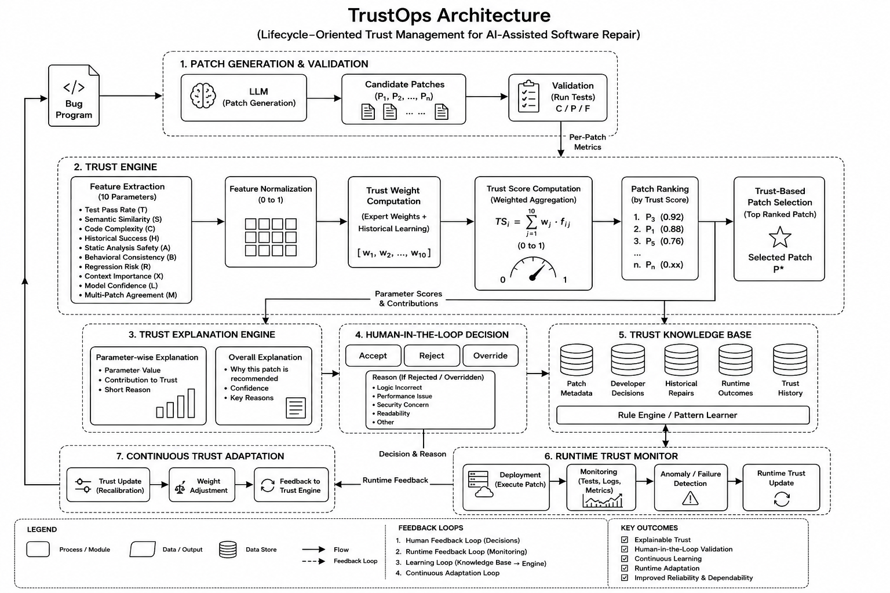

# TrustOps: Lifecycle-Oriented Trust Management Framework for Reliable AI-Assisted Software Repairs



## Overview

**TrustOps** is a Lifecycle-Oriented Trust Management Framework for AI-Assisted Software Repair. The primary goal of TrustOps is not just to generate software patches, but to continuously **evaluate, explain, validate, learn from, and adapt** the trustworthiness of AI-generated patches throughout their entire lifecycle. 

TrustOps builds upon previous research on *TrustPatch* (which focused on trust-aware patch ranking) and extends it into a complete, end-to-end trust lifecycle framework designed to bridge the gap between raw AI patch generation and safe, confident production deployment.

### The Trust Lifecycle
1. Patch Generation
2. Validation
3. Trust Computation
4. Trust-Based Patch Selection
5. Trust Explanation
6. Human-in-the-Loop Validation
7. Trust Knowledge Base
8. Runtime Monitoring
9. Continuous Trust Adaptation

---

## System Architecture & Modules

The system is built on a React/Tailwind frontend (Vite) and a FastAPI/SQLAlchemy backend (Dockerized SQLite). The architecture consists of several core modules working in tandem:

### 1. Trust Validation Engine
Evaluates a generated patch across a **10-Dimensional Trust Space**. Instead of just looking at test passes, it scores the patch from 0 to 1 across:
- **T** (Functional Correctness)
- **S** (Semantic Alignment)
- **C** (Complexity Penalty)
- **H** (Historical Reliability)
- **A** (Author Intent Match)
- **B** (Behavioral Preservation)
- **R** (Security & Risk)
- **X** (Explainability)
- **L** (Log & Telemetry Impact)
- **M** (Maintainability)

### 2. Trust Explanation Engine
Translates raw numerical metrics into a human-readable summary. It classifies the confidence level (High, Medium, Low), explains the strengths and risks of the patch, and specifically flags if the AI might be "test gaming" (e.g., passing a test without actually fixing the underlying logic).

### 3. Human-in-the-Loop Review
Provides a developer interface to review the patch alongside its trust score and explanation. Developers can:
- **Accept**: Agrees the patch is safe for deployment.
- **Reject**: Rejects the patch, requiring a predefined reason (e.g., "Performance concerns").
- **Override**: Rejects the top recommended patch in favor of an alternative generated patch.

### 4. Trust Knowledge Base
Acts as the memory of the system. Every time a developer makes a decision, the system atomically saves a full snapshot of the context. This includes the bug context, the patch code, the exact 10-D trust metrics, the human decision, and the reason.

### 5. Runtime Trust Monitor
Tracks the patch after it has been deployed. It generates simulated live telemetry (CPU usage, memory, latency, exceptions) and builds a timeline of "Runtime Events" to continuously assess the patch's health and runtime trust (High/Medium/Critical).

### 6. Analytics & Adaptation
Aggregates data from the Knowledge Base and Runtime Monitor to generate high-level metrics (e.g., Developer Acceptance Rate, Average Trust Score, Repair Success Rate) for research dashboards.

---

## End-to-End User Flow

1. **Dashboard Entry**: The user lands on the TrustOps dashboard and selects a patch evaluation session (e.g., a recently generated fix).
2. **Patch Evaluation**: Navigates to the "Patch Evaluation" screen.
   - **Trust Score Center**: Displays the overall weighted trust score (0-100) and the 10-dimensional radar breakdown.
   - **Explanation Panel**: Provides plain-English context, highlighting strengths and risks.
3. **Human Review**: The developer states whether they agree with the assessment and submits a decision (Accept, Reject, Override).
4. **Deploy & Monitor**: Upon accepting a patch, clicking "Deploy & Monitor" starts a runtime session.
5. **Runtime Monitoring**: Logs an "Initial Deployment" event. Users can simulate live telemetry to watch the patch's health status update dynamically.
6. **Knowledge Base Review**: At any point, users can view a historical table of all decisions made, complete with expandable rows showing the 10-D metric snapshots.

---

## Technology Stack

**Frontend:**
- React (Vite)
- TypeScript
- TailwindCSS

**Backend:**
- FastAPI
- Python
- SQLAlchemy (SQLite)

**Deployment:**
- Docker & Docker Compose
- Render / Vercel

---

## Getting Started

### Prerequisites
- Node.js (v18+)
- Python (3.9+)
- Docker (optional, for containerized deployment)

### Local Development Setup

#### 1. Backend Setup (FastAPI)
```bash
cd backend
python -m venv venv
# On Windows: venv\Scripts\activate
# On macOS/Linux: source venv/bin/activate
pip install -r requirements.txt
uvicorn app.main:app --reload
```

#### 2. Frontend Setup (React/Vite)
```bash
cd frontend
npm install
npm run dev
```

### Docker Deployment
To run the entire stack using Docker:
```bash
docker build -t trustops-app .
docker run -p 8000:8000 -p 5173:5173 trustops-app
```
*(Ensure Docker configurations are adjusted based on your `docker-compose.yml` or specific `Dockerfile` instructions)*
